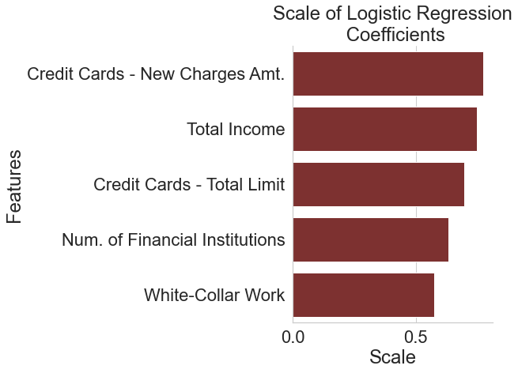

# Vanguard's $1,000 Question: Analyzing U.S. Households' Liquid Assets

**Author**:[Dan Valenzuela](mailto:dan@danvalenzuela.com)

## Overview
This project develops a logistic regression model to help Vanguard determine households that would be likely to invest in their mutual fund products. The model was trained on data from the Federal Reserve's Survey of Consumer Finances and the model was improved by taking into account various outliers in the data through various methods. The best model achieved an F1-score of .9159 and showed that the number of financial instutions one banks with and one's creditworthiness predict the ability to afford Vanguard's services

## Problem
Vanguard Group is a financial services company that has been a pioneer in creating mutual funds, a type of investment vehicle that helps investors reach their financial goals. However, many financial services companies are making it cheaper to invest in their products, making Vanguard's market-leading inflows more precarious going forward. This project aims help Vanguard answer the following question  by implementing a logistic regression model trained on data provided by the Federal Reserve: which households have enough money to invest with Vanguard? 


## Data

The data used comes from the Federal Reserve's 2019 Survey of Consumer Finances (SCF). The SCF has two primary quirks that this project aims to overcome: (1) it provides 5 copies of data for each household and (2) it oversamples wealthy households. 

The primary variables taken from the SCF relate to a household's demogrpahics--such as age, sex, and employment data--and to a household's detailed finances. On the household's detailed finances point, the figure below shows how this dataset tends to oversample wealthy households. Althought he figure seems to show there are very few outliers, the fact that the maximum axis extends so far out indicates a large nubmer of outliers with very high values.


## Methodology

This project iterated through multiple different logistic models after implementing a baseline. The primary features of the final model include using sample weights in the SCF, using L2 regularization with GridSearchCV, and using sklearn's RobustScaler. 

As one will see in the Results, the ability to overcome to overrepresentation of wealthy households using weighting is important. Further, one can see in the figure below how weighting improves the representation of less well-off households.


## Results

This model achieves an F1 score of 0.9159, an improvement of about .09 compared to baseline. This was primarily achieved by improving precision scores by accounting for the data's oversampling of high wealth households and the skewness of the distribution of liquid assets. 



## Conclusion

Given the high F1 score of all the models presented here, one can conclude that the top features presented in each model that predict membership in the target class are likely to be features that Vanguard ought to search for.

In the case of number of financial institutions, Vanguard may consider adopting services like Plaid that other financial services companies use to understand whether households use other services. Further, the final model presented here also reinforces any use of credit reports that Vanguard may use to market to households. Lastly, given that having a bachelor's degree is predictive of having enough money to invest with Vanguard, it may also make sense for Vanguard to improve its marketing to those who are just graduating college.

## Repository Structure

```
├── README.md                           <- The top-level README for reviewers of this project
├── walkthrough.ipynb                   <- Narrative documentation of analysis 
├── Vanguard.pdf                        <- PDF version of project presentation
├── src                                 <- Contains python modules
│   └── modules                         <- .py files
├── images                              <- Both sourced externally and generated from 
│                                          code
├── notebooks                           <- Noteboooks used to build Walkthrough
└── data                                <- Data obtained from the Federal Reserve
    └── extracted                       

```
